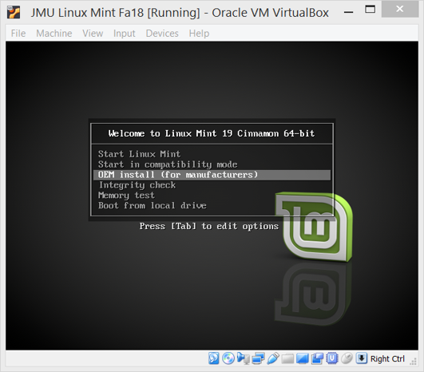
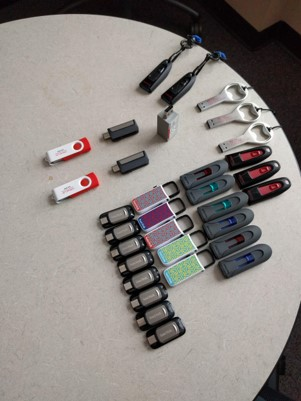
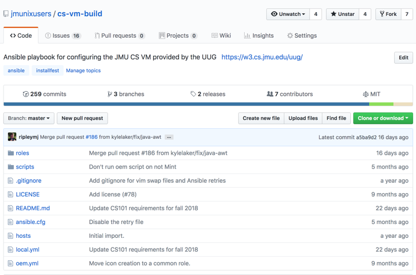

# How to build a CS VM

---

# Follow along:

## <https://github.com/jmunixusers/cs-vm-build>

---

# History

---

# Early encounters

- In the early 2000’s, students were primarily using desktops with big CRT (tube) monitors
- Virtualization barely existed
- InstallFests were all day ordeals
- Repartitioning and dual-booting was the only option
- Only about six people would show up
  - Two left with two operating systems
  - Two left with one operating system
  - Two left with no operating system

---

# Early encounters

- Windows XP lacked the ability to resize partitions or dual-boot
- The arrival of laptops brought an explosion of uncooperative hardware
- WiFi and graphics drivers have always struggled on Linux
- No one could casually try Linux
- Removing Linux after trying an InstallFest was as risky as installing it with XP’s deficiencies
- CS labs were Windows and Mac at this point, giving students little incentive to match the classroom experience

---

# The move to virtualization

- The first Intel virtualization support arrived in 2005, with refinements in 2008
- The nice features take a few years to appear in mobile CPUs, and a few more years for widespread adoption
- VMware Workstation has always been expensive, and VirtualBox first appeared in 2007 (likely wasn’t given away free until it was bought by Sun Microsystems)

---

# Early VMs

- InstallFest attendees in the early VM days got a copy of VirtualBox and an install disk/ISO
- Got to run through the VM creation and installation themselves
- Much harder to keep a group working together than it is today
- Realized after a while that taking an hour of people’s time just to tell them to keep clicking “Next” wasn’t useful
- No time during an InstallFest to teach what’s going on during OS installation, and still get the installation done

---

# Approaching today

- 2-3 years ago, the UUG starting building a VM appliance
- Figured if there was no value in watching the installer, we should just skip it
- Everything was set up manually from a few rough notes
- VM snapshots kept the whole project from collapsing
- The VM was upgraded and dragged forward semester to semester
- CS labs started replacing RedHat with Linux Mint

---

# The modern era

- Last year, Dr. Mayfield approached the UUG about bringing together our VM and the CS101 class
- Software required for 101 grew the VM from ~2GB to 3GB+
- Shortly after, there was talk of adding another GB of CS354 robotics content
- We wanted to keep everybody working together, but…
  - Couldn’t sustain the size growth of the VM
  - Tracking all the setup notes was more difficult
  - Only one person could work on the VM at a time
- Ansible-powered VM was invented in fall of 2017
- Multiple contributors can add additional classes without inconveniencing other users

---

# Design considerations

- Make it your own workspace, users configure their own preferences on first boot, give it their own name, and set their own password
- Least surprise
  - Never modify preferences like appearance, fonts, colors, etc
  - Never remove applications, which is why we don’t offer a class “uninstall” option
  - Never modify something during packaging that removes an typical ability of Mint/Ubuntu
- Keep it lightweight
  - Fast downloads, fits on a flash drive, doesn’t clog up laptop hard drives
- Prefer JMU mirror, faster downloads from mirror.cs.jmu.edu
- Working to make our setup work between VM and laptops

---

# VM Skeleton

---

# VM Skeleton - too many buttons to get right


---

# Script it!
```
VBoxManage createvm --name "%VM%" --ostype Ubuntu_64 --register
VBoxManage modifyvm "%VM%" --cpus 2 --memory 2048 --vram 64
VBoxManage storagectl "%VM%" --name "SATA Controller" --add sata --bootable on --portcount=4
VBoxManage createhd --filename "%VMDISK%" --size 20480 --variant Standard
VBoxManage storageattach "%VM%" --storagectl "SATA Controller" --port 0 --device 0 --type hdd --medium "%VMDISK%"
VBoxManage storageattach "%VM%" --storagectl "SATA Controller" --port 1 --device 0 --type dvddrive --medium "%VMINSTALLDISK%"
VBoxManage modifyvm "%VM%" --audioout on
VBoxManage modifyvm "%VM%" --clipboard bidirectional
VBoxManage modifyvm "%VM%" --mouse usbtablet
VBoxManage modifyvm "%VM%" --usb on --usbehci off --usbxhci off
VBoxManage modifyvm "%VM%" --accelerate3d on
```

---

# Linux Mint OEM

Move quick, get the GRUB menu



---

# Linux Mint OEM


---

# Linux Mint OEM


---

# The theory of Ansible

---

# Ansible key themes

- A Python script for turning YAML files into Python scripts
- Designed to efficiently manage thousands of machines
- Extensible interface and community (Ansible Galaxy) hub to extend its capabilities in limitless ways
- Recently acquired by RedHat and developed as open-source core with commercially supported edition
- MTBIAGSD - “Mean time between idea and getting shit done”
- Project founders believe that you should be able to start getting real work done within an hour of encountering Ansible

---

# I·dem·po·tent - /ˌīdemˈpōt(ə)nt,ˈēdemˌpōt(ə)nt/

- "Idempotence is the property of certain operations in mathematics and computer science whereby they can be applied multiple times without changing the result beyond the initial application." -- Wikipedia
- Ansible configuration describes the desired end state, not the steps to get there
- Allows playbooks to be repeated, and steps will be quickly completed as they’re found to be already correct
- Watch an Ansible run and you’ll notice steps displayed as "Changed"
- A correct playbook should report no changes when run twice back-to-back

---

# Building Ansible

- A role contains tasks, handlers, files, templates, and variables
- A playbook is a series of tasks
- A handler is a step that only runs if a designated tasks reports that it “changed”
  - Example - restart a service only if you modify its configuration
- Tasks, handlers, and variables use YAML syntax
- Templates and variable interpolation use Jinja2 syntax
- A task can be given a list of items to bulk process, using a YAML array

---

# Our misuse of Ansible

---

# Quick reminder:
## <https://github.com/jmunixusers/cs-vm-build>

---

# Misusing Ansible

- We only modify one host at a time - your laptop
- We use the “local” connection type, not SSH or WinRM
- Roles encapsulate one of:
  - Multi-step installations for applications used across multiple classes - Eclipse, jGRASP
  - An assortment of simple steps unique to one class - basic-prog-pkgs
- The "oem" role runs before packaging the VM
- The "common" role always runs
- Course tags determine which roles run for each class - cs101, cs149

---

# Role overview

```
- roles:
  - { role: common, tags: always }
  - { role: wireless-printing, tags: always }
  - { role: filezilla, tags: always }
  - { role: basic-prog-pkgs, tags: ["cs101"] }
  - { role: adv-prog-pkgs, tags: ["cs261"] }
  - { role: robot-pkgs, tags: ["cs354"] }
  - { role: eclipse, tags: ["cs101", "cs149", "cs159"] }
  - { role: jgrasp, tags: ["cs149"] }
  - { role: drjava, tags: ["cs149"] }
  - { role: finch, tags: ["cs101"] }
  - { role: task-shortcuts, tags: always, icon_mode: user }
  - { role: y86, tags: ["cs261"] }
```

---

# Step-by-step playbooks - roles/drjava/tasks/main.yml

```
- block:
  - name: Create DrJava directory
    file:
      path: '{{ drjava.install_path }}'
      state: directory
  - name: Fetch DrJava jar
    get_url:
      url: '{{ drjava.url }}'
      dest: '{{ drjava.jar }}'
      force: yes
when: st.stat.checksum|default("") != drjava.hash
```
---

# Step-by-step playbooks - roles/drjava/tasks/main.yml continued

```
- name: Install DrJava menu shortcut
  template:
    src: drjava.desktop.j2
    dest: /usr/local/share/applications/drjava.desktop
    mode: 0644
  notify:
    - Update desktop menu
- name: Install DrJava start script
  template:
    src: drjava.sh.j2
    mode: 0755
    dest: '{{ drjava.install_path }}/drjava.sh'
```
---

# Playbook variables - roles/drjava/vars/main.yml

```
drjava:
  url: 'https://sourceforge.net/projects/drjava/files/1.%20DrJava%20Stable%20Releases/drjava-beta-20160913-225446.jar/download'
  hash: '3f0f4ade34b4e330d9a039368ddd04b424c43f43'
  install_path: '{{ global_base_path }}/drjava'
  jar: '{{ global_base_path }}/drjava/drjava.jar'
```

---

# Playbooks with lists - roles/basic-prog-pkgs/tasks/main.yml

```
- name: Install introductory development packages
  apt: name={{ item }} state=latest
  with_items:
    - artha
    - bless
    - chromium-browser
    - fonts-crosextra-caladea
    - fonts-crosextra-carlito
    - geany
    - idle-python3.6
    - libreoffice
```

---

# Making it usable


` $ ansible-pull -U https://github.com/jmunixusers/cs-vm-build -C master -t common local.yml`

- We’re targeting first-week CS students
- CLIs are hard/scary/intimidating/new
- GUIs are safe/happy/familiar

---


---

# The magic

- Checks the OS (Mint, other)
- Checks the version (Sylvia, Tara, Tessa, etc.)
- Sets the branch and repo to pull from
- Checks user configuration
- Calls pkexec and ansible-pull
- Displays output in mini-terminal
- Checks that Ansible succeeded
- Logs additional information

---

# Coming soon...

- Automagic PR testing
- Button for opening log directories
- Button for reporting issues
- Telemetry (opt-in)
- uugconfigd?

---

# SHIP IT!

---

# Lots and lots of flash drives




---

# Contributing to the project

